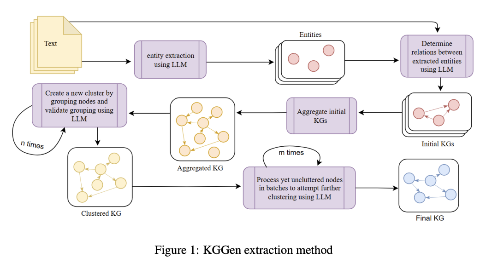
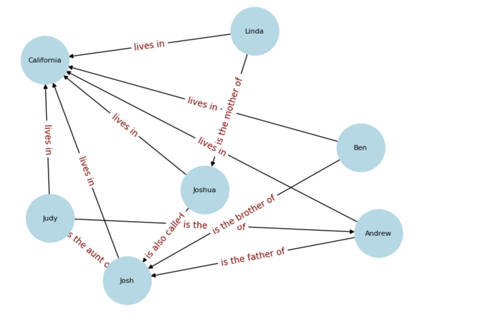
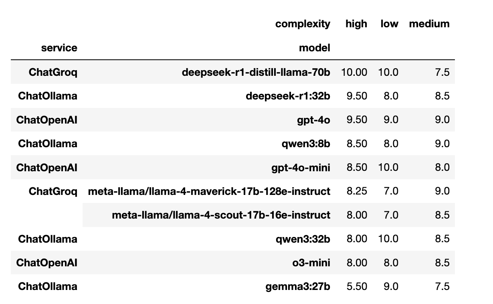

# Knowledge Graph Generator with Langchain

[](https://badge.fury.io/py/langchain-kggen)
[](https://www.python.org/downloads/)
[](https://opensource.org/licenses/MIT)

A powerful Python library for generating knowledge graphs from unstructured text using LangChain and Large Language Models (LLMs). Extract entities, relationships, and create structured knowledge representations with support for clustering, chunking, and parallel processing.

Note: This project and the contents of it are inspired by KGGen as proposed in [this paper](https://arxiv.org/pdf/2502.09956), Feb 2025.

## Table of Contents

* [Features](#features)
* [Installation](#installation)
* [Framework Workflow](#framework-workflow)
* [Quick Start](#quick-start)
* [Advanced Features](#advanced-features)
* [Standalone Clustering](#standalone-clustering)
* [Aggregating Multiple Graphs](#aggregating-multiple-graphs)
* [Long Text Extraction](#long-text-extraction)
* [Architecture](#architecture)
* [Graph Structure](#graph-structure)
* [Eval Report](#eval-report)
* [Configuration Options](#configuration-options)
* [Use Cases](#use-cases)
* [Best Practices](#best-practices)
* [Contributing](#contributing)
* [License](#license)
* [Acknowledgments](#acknowledgments)

## Features

* **LLM-Powered Extraction**: Leverage any LangChain-compatible language model for intelligent entity and relation extraction
* **Knowledge Graph Generation**: Create structured graphs with entities, relations, and edges from raw text or conversations
* **Semantic Clustering**: Automatically cluster similar entities and relations using LLM-based semantic understanding
* **Parallel Processing**: Handle large texts efficiently with concurrent chunk processing
* **Conversation Support**: Extract knowledge graphs from conversational data (chat logs, dialogues)
* **Flexible Input**: Process both plain text and structured conversation formats
* **Customizable**: Fine-tune extraction with context, chunk sizes, and clustering parameters
* **Export Support**: Save generated graphs to JSON format for further analysis

## Installation

```bash
pip install langchain-kggen
```

## Framework Workflow

As proposed in the original paper:



## Quick Start

### Basic Usage

```python
from langchain_kggen import KGGen
from langchain_openai import ChatOpenAI
from langchain_ollama import ChatOllama

# Initialize your LLM
llm = ChatOpenAI(model="gpt-4o")
llm = ChatOllama(model='deepseek-r1:32b')  # for local models

text = """
Linda is the mother of Joshua. Joshua is also called Josh. Ben is the brother of Josh.
Andrew is the father of Josh. Judy is the sister of Andrew. Josh is the nephew of Judy.
Judy is the aunt of Josh. The family lives in California.
"""

kg_generator = KGGen(llm=llm, input_data=text)
graph = kg_generator.generate()

print("Entities:", graph.entities)
print("Relations:", graph.relations)
print("Edges:", graph.edges)

# Visualise
from langchain_kggen.utils.viz import draw_graph
draw_graph(graph)
```


### Processing Conversations

```python
conversation = [
    {"role": "user", "content": "Tell me about artificial intelligence"},
    {"role": "assistant", "content": "AI is a field of computer science focused on creating intelligent machines"},
    {"role": "user", "content": "What are the main types of AI?"},
    {"role": "assistant", "content": "The main types include narrow AI, general AI, and superintelligence"}
]

kg_generator = KGGen(llm=llm, input_data=conversation)
graph = kg_generator.generate()
```

## Advanced Features

```python
graph = kg_generator.generate(
    context="Technology and business domain",
    chunk_size=1000,
    cluster=True,
    max_workers=5,
    llm_delay=1.0,
    output_folder="./output",
    file_name="my_knowledge_graph.json"
)

if graph.entity_clusters:
    print("Entity clusters:", graph.entity_clusters)
if graph.edge_clusters:
    print("Edge clusters:", graph.edge_clusters)
```

## Standalone Clustering

```python
clustered_graph = kg_generator.cluster(
    graph=graph,
    context="Business and technology context"
)
```

## Aggregating Multiple Graphs

```python
graph1 = kg_generator.generate()
graph2 = kg_generator.generate()
aggregated_graph = kg_generator.aggregate([graph1, graph2])
```

## Long Text Extraction

```python
with open("large_document.txt", "r") as f:
    large_text = f.read()

kg_generator = KGGen(llm=llm, input_data=large_text)

graph = kg_generator.generate(
    context="Domain-specific context for your document",
    chunk_size=5000,
    cluster=True,
    max_workers=8,
    llm_delay=1.5,
    output_folder="./output",
    file_name="large_document_kg.json"
)

print(f"Extracted {len(graph.entities)} entities from large text")
print(f"Found {len(graph.relations)} relationships")

if graph.entity_clusters:
    for representative, variants in graph.entity_clusters.items():
        if len(variants) > 1:
            print(f"Clustered '{representative}': {variants}")
```

**Key Benefits for Long Texts**:

* **Chunking**: Breaks large texts into manageable pieces while respecting sentence boundaries
* **Parallel Processing**: Processes multiple chunks concurrently
* **Cross-chunk Clustering**: Merges similar entities across segments
* **Semantic Coherence**: Maintains contextual integrity across documents

## Architecture

### Core Classes

* `KGGen`: Main interface for knowledge graph generation
* `Graph`: Pydantic model representing a knowledge graph

### Extraction Modules

* `get_entities`: Extract entities from text
* `get_relations`: Extract subject-predicate-object triples
* `get_clusters`: Perform semantic clustering

### Utilities

* `chunk_text`: Sentence-boundary-aware chunking
* `draw_graph`: Draws graph with networkx for quick visual insights, clumsy for very large texts
* `state`: Graph data models and state structures

## Graph Structure

```python
class Graph(BaseModel):
    entities: set[str]
    edges: set[str]
    relations: set[Tuple[str, str, str]]
    entity_clusters: Optional[dict[str, set[str]]]
    edge_clusters: Optional[dict[str, set[str]]]
```

## Eval Report

The model was evaluated on 10 diverse samples using a high-performing LLM as the judge. The image below shows the average quality scores across varying complexity levels:



## Configuration Options

| Parameter       | Type            | Default                 | Description                |
| --------------- | --------------- | ----------------------- | -------------------------- |
| `llm`           | `BaseChatModel` | None                    | Override default LLM       |
| `context`       | `str`           | ""                      | Additional context         |
| `chunk_size`    | `int`           | None                    | Chunk size in characters   |
| `cluster`       | `bool`          | False                   | Enable semantic clustering |
| `max_workers`   | `int`           | 10                      | Parallel threads           |
| `llm_delay`     | `float`         | 2.0                     | Delay between LLM calls    |
| `output_folder` | `str`           | None                    | Save location              |
| `file_name`     | `str`           | 'knowledge\_graph.json' | Output filename            |

## Use Cases

* **Document Analysis**: Extract insights from papers, reports
* **Conversation Mining**: Analyze dialogues, support logs
* **News Processing**: Build structured knowledge from articles
* **Information Extraction**: Turn unstructured data into triples
* **AI Training Data**: Generate structured inputs for ML tasks
* **Business Intelligence**: Extract graphs from emails, memos, docs

## Best Practices

1. Provide rich context for higher fidelity results
2. Use chunking for large texts to avoid context loss
3. Enable clustering for disambiguation
4. Respect API rate limits with `llm_delay`
5. Review and refine generation parameters iteratively

## Contributing

We welcome contributions! Please see our [Contributing Guidelines](CONTRIBUTING.md) for how to get involved.

## License

This project is licensed under the MIT License. See the [LICENSE](LICENSE) file for full details.

## Acknowledgments

* Novel ideas derived from the paper *"KGGen: Extracting Knowledge Graphs from Plain Text with Language Models"* by Belinda Mo et al.
* Implementation inspired by their published [PyPI project](https://pypi.org/project/kggen/)
* Built atop the excellent [LangChain](https://github.com/langchain-ai/langchain)
* Thanks to the open-source community for support and contributions
